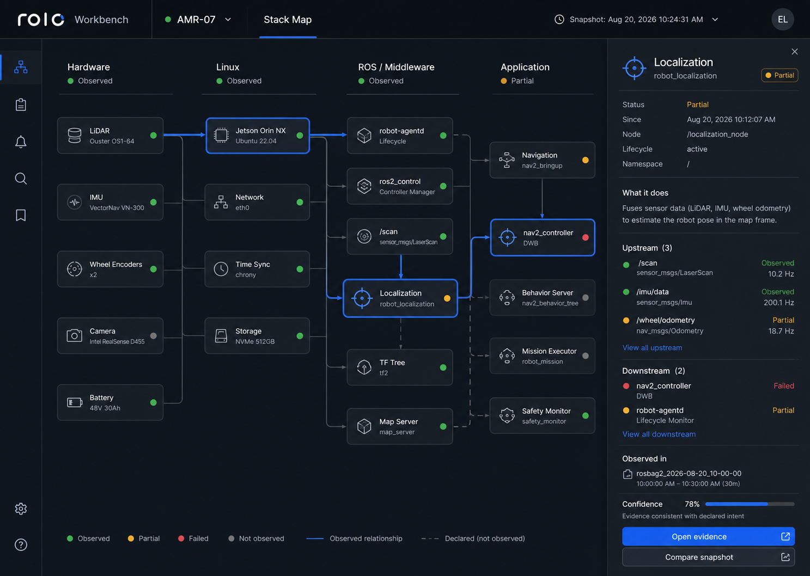

# rolo-vis

[English](README.md)

`rolo-vis` 是 [rolo](https://github.com/zarcherlot/rolo) 的只读 Web 工作台，
把机器人发现、拓扑、能力、生命周期、Episode 与证据汇聚到一个可追溯的工程视图中。

> 看清系统栈，核对数据合同，沿着证据推进问题。



## 当前状态

当前版本为 `0.38.0`，对应 rolo v2 的只读 Workbench 合同。MVP 有意保持只读：工作台可以解释 rolo 已发布的数据，但不会
操作机器人、批准 Job 或修改目标。优先读取真实 rolo 数据；控制面不可达时，可以使用
明确标注的 demo 模式进行体验。

## 功能概览

- **Stack Map：** 以 Hardware → Linux → ROS/Middleware → Application 四层拓扑为主线，
  展示经过验证的快照、有限差异、路径解释和证据下钻。
- **Tool Surface：** 先显示 MHS（Machine/Hardware Service）发现与注册状态，再显示
  每个 Tool 的验证状态。只有 `VERIFIED` 且通过策略检查的 Tool 会标记为
  `Agent-callable`；`DISCOVERED_UNVERIFIED`、`PENDING`、`UNAVAILABLE` 均保持只读且不可调用。
- **Robot Knowledge Base：** 以 rolo v2 的 `identity`、`hardware`、`os_runtime`、
  `middleware`、`application`、`capabilities`、`state_safety` 等节点呈现机器人当前全貌。
  当前控制面没有原生 `/rkb` read model 时，界面会明确标注为“Derived from validated
  read models”，并保留 freshness、来源和 UNKNOWN 状态，不把推断伪装成观测事实。
- **Fleet 与机器人视图：** 查看 readiness、阻塞项、机器人概览、生命周期门禁、Wiki、
  发现历史和证据来源。
- **Capabilities：** 查看 canonical operation 合同、binding、覆盖率、风险/生命周期
  筛选和 readiness 信号；Agent 推断始终位于独立的“已发现但未验证”通道。
- **Episode Studio：** 查看修订锁定时间线、诊断焦点、双侧比较、精确匹配 Cohort、
  Evidence 上下文、评审交接和 Observation Bundle。
- **协商式只读 read model：** Job 历史、Target Readiness、Approval/Gate/Recovery 和
  Artifact Analysis 仅在 rolo 宣布对应版本化 feature 后显示；不支持或不安全的 payload
  会直接拒绝渲染。

工作台不会读取本地文件或 artifact 字节，不会暴露原始路径、凭据，也不会调用
bootstrap、resume、retry、cancel、rollback、release 等写接口。完整边界见
[MVP 只读基线](docs/MVP_READONLY_BASELINE.md)。

## 快速开始

环境要求：Node.js 24（CI 使用的版本）和 npm。

```powershell
npm install
npm run dev
```

打开 Vite 输出的地址。开发模式下，`/rolo-api` 默认代理到
`http://127.0.0.1:8080`。如需指定其他控制面地址：

```powershell
$env:VITE_ROLO_API_BASE = 'http://127.0.0.1:8080'
npm run dev
```

如果只想保持浏览器同源、但更换本地代理目标，请在启动 Vite 前设置
`ROLO_API_PROXY_TARGET`。没有兼容的 rolo API 时，界面会明确标出 demo 数据；真实请求
失败不会被静默替换成 fixture。

## 变更验证

```powershell
npm run typecheck       # TypeScript 检查
npm test                # 应用与合同测试
npm run build           # 生产构建及 Sites 交付文件
npm run test:sites      # worker/hosting 打包检查
npm run test:v2         # v2 manifest、RKB/MHS/Tool Surface 契约检查
```

`npm run build` 还会生成机器人本地插件包所需的 `SHA256SUMS`，覆盖 manifest、入口和
所有客户端静态资源。

完整的 release-candidate 门禁还包括设备加固检查：

```powershell
npm run verify:baseline
```

## 架构速览

浏览器通过轻量 client 层访问 rolo。`src/contracts/` 中的版本化 parser 负责校验每个
响应；`/health` 中的 feature negotiation 决定哪些 surface 可以请求数据；视图只渲染
有界且由 producer 负责的摘要。`worker/` 入口和 `scripts/prepare-sites-build.mjs`
将同一份构建产物打包为 Sites 可部署版本。

```text
rolo control plane ── /rolo-api ──> roloClient ──> contracts + feature gates ──> views
                                      │
                                      ├── Tool Surface: MHS discovery/registration → Tool verification → Agent-callable
                                      ├── RKB: validated read models → explicit derived projection
                                      └── live 不可用时使用明确标注的 demo fixture
```

## 文档

[文档指南](docs/README.md) 是唯一入口，区分长期有效的合同/基线、运行手册和已归档的
阶段性计划。

- [产品方案](docs/WEB_VISUALIZATION_PRODUCT_PROPOSAL.md)：产品定位和信息架构。
- [MVP 只读基线](docs/MVP_READONLY_BASELINE.md)：信任模型与能力边界。
- [Episode Studio 合同](docs/EPISODE_STUDIO_CONSUMER_CONTRACT.md)：Episode read model
  与交互规则。
- [外部收口运行手册](docs/ROLO_EXTERNAL_CLOSURE_RUNBOOK.md)：晋级 candidate 基线前所需
  的 staging/设备证据。
- [选定视觉方向](docs/design/selected-stack-map.png)：以拓扑为主线的视觉源文件。
- `rolo-v2/docs/architecture/RKB_WEB_READ_MODEL_CONTRACT_ZH.md`：RKB、MHS 与 Tool
  verification HTTP projection 及信任规则。

## 贡献指南

保持变更有界、以证据为依据。公共 read model 发生变化时，应同步更新合同、parser、
feature gate、负向测试和基线记录；不要突破只读边界。创建 PR 前请运行
`npm run verify:baseline`。

本项目可以直接交付给 [Sites](https://openai.com/index/introducing-codex/)，无需修改
`.openai/hosting.json`、`worker/index.js`、`scripts/prepare-sites-build.mjs` 或
`tests/sites-worker.test.mjs`。
